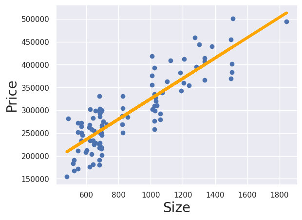

# Simple Linear Regression for Real Estate Prices

This repository contains a simple linear regression model to analyze the relationship between the size (square footage) and price of houses. The goal is to predict house prices based on their size using a linear regression model.

## Table of Contents

- [Introduction](#introduction)
- [Dataset](#dataset)
- [Dependencies](#dependencies)
- [Installation](#installation)
- [Usage](#usage)
- [Results](#results)

## Introduction

Linear regression is a basic and commonly used type of predictive analysis. The overall idea of regression is to examine two things:

- Does a set of predictor variables do a good job in predicting an outcome (dependent) variable?
- Which variables in particular are significant predictors of the outcome variable, and in what way do they impact the outcome variable?

In this project, we use a simple linear regression model to predict house prices based on their sizes.

## Dataset

The dataset used for this project contains information on house sizes and their corresponding prices. A sample dataset (`house_prices.csv`) is included in this repository with the following structure:

```
Size, Price
1500, 300000
1600, 320000
1700, 340000
...
```

## Dependencies

- Python 3.x
- pandas
- numpy
- matplotlib
- scikit-learn

You can install the required dependencies using the following command:

```sh
pip install pandas numpy matplotlib scikit-learn
```

## Installation

1. Clone the repository:

```sh
git clone https://github.com/yourusername/real-estate-linear-regression.git
```

2. Navigate to the project directory:

```sh
cd real-estate-linear-regression
```

3. Install the dependencies:

```sh
pip install -r requirements.txt
```

## Usage

1. Ensure you have the `house_prices.csv` dataset in the project directory.

2. Run the `linear_regression.py` script to train the model and make predictions:

```sh
python linear_regression.py
```

3. The script will output the regression coefficients, intercept, and a plot of the regression line with the data points.

## Results

The output of the script includes:

- Regression Coefficient (slope): Indicates how much the house price changes for a unit change in size.
- Intercept: The expected price when the size is zero.
- A plot showing the data points and the fitted regression line.


